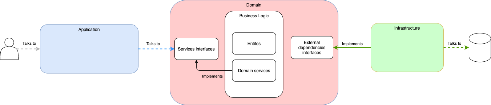

# JEFF CHALLENGE

Data model considerations
---
Taking into account the subsets in the challenge. Product and Satisfaction entities have been designed considering the subsets data types.

I would not recommend using numbers as identifiers since this can be a problem when merging databases from different environments because of collisions between these IDs.
So, changing these IDs to UUIDs in the Product entity, would improve this aspect in terms of maintainability.

General considerations
---
- Customer ID is designed as a UUID
- Customer can be retrieved by this UUID
- Score service is deployed by default at port 9001 on localhost
- Score service uses in docker the service name "score-service"
- Customer service is deployed by default at port 9002
- Customer service uses in docker the service name "customer-service"

Tech stack
---
The project used the followig technologies:
- Java 11
- Spring Boot 2.6.7
- Graphql DGS Framework 4.10.2
- Spring Cloud Circuitbreaker 2.1.1
- MongoDB 4.4

Security
---
In a production environment these APIs should have a security layer using JWT tokens or the OAuth2 standard.
Also, having an API Gateway, and also, if having too many GraphQL services, it is very interesting including an Apollo Gateway to merge all these GraphQL APIs in one single service and expose a big schema to the frontend, instead of multiple different schemas.

API documentation
---
The API is documented using comments in the GraphQL schema. Going into the GraphiQL endpoint, you can see those comments in the Docs section on the right hand side 

- GraphiQL: <ur>http://localhost:8080/graphiql</url>

Heathcheck
---
The API have the basic actuator endpoints to check if the service is running.

- Health endpoint: <ur>http://localhost:8080/actuator/health</url>

**NOTE: In docker it is exposed in a different port, because of security reasons, it is interesting to expose outside only your API because in the management endpoints lot of internal information is exposed**

Software architecture
---

The code is structured in three layers so we can have a codebase more scalable, maintainable and testable.

The application layer is the only one that interacts with the user or any third party wanting to interact with our application. It is the *entrypoint*. Here we have the implementation of the GraphQL queries and mutations all along with the mappers to transform the incoming objects to the domain layer.

In the domain layer, we define our domain and we work with our entities to perform some business logic, such as performing a recommendation or getting some recommendations. Also, we define the interfaces for the repositories or any other external APIs (score and customer service).

The infrastructure layer contains all the implementations for the APIs or repositories defined on the domain layer and the configuration parameters for our application, such us the customer and score services APIs. Also, we define the custom configurations for our databases and, in this case.

Build
---
In order to build all components, from root folder you have to do one of the following steps:

- Compile and build docker image:  
  From the root folder, run the following command:  <code>./gradlew build && cd docker && ./build-image.sh</code>

- Compile:  
  From the root folder, run the following command:   <code>./gradlew build</code>

- Compile skipping tests:  
  From the root folder, run the following command:   <code>./gradlew build -PskipTests</code>

Run in docker
---

From root folder you have to run the following command
- <code>docker-compose up -d</code>

When you run docker compose, these are the ports exposed to your computer:
- 27017 for MongoDB
- 8080 for Recommender graphql port
- 8081 for Recommender management port

FAQ
---
1. Why using a NoSQL database such as MongoDB?
     Since it is a recommendation system, most probably is that we have so many recommendations, so we will need a system with horizontal scalabilty.

2. Why using Graphql?
     According to the description, this service needs to be consumed by a frontend, so GraphQL is the best tool for that since the UI can request only the needed data with the JSON structure defined in the schema. So there is no need to write extra endpoints to retrieve more data or less, just modelling in the schema and the UI will request only what is needed, reducing also the network load to the necessary one.
